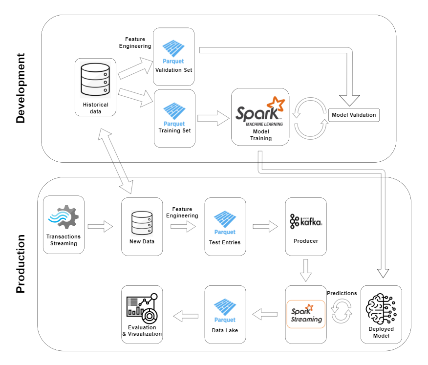

# Fraud-detection Project

---

## Project Architecture

---
## Reference
title: "Reproducible Machine Learning for Credit Card Fraud Detection - Practical Handbook"  
author: Le Borgne, Yann-A{\"e}l and Siblini, Wissam and Lebichot, Bertrand and Bontempi, Gianluca  
url: https://github.com/Fraud-Detection-Handbook/fraud-detection-handbook  
year: 2022  
publisher: Universit{\'e} Libre de Bruxelles
